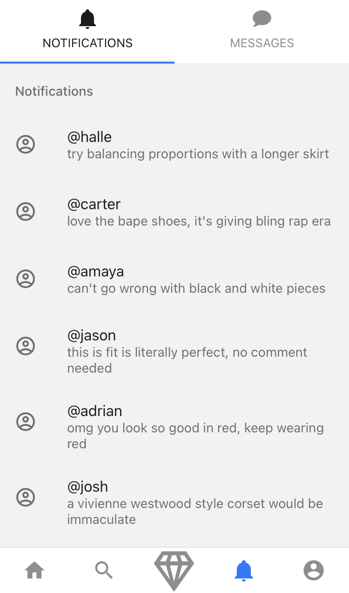

# fitcheck

## Overview

Our app, Fitcheck, will allow users to share their pictures of their outfits. Similar to VSCO and TikTok, users can either upload pictures and videos to a public feed and show off their outfit of the day, or ask for suggestions to improve their fashion. Our app will provide filters with the ability to sort by different styles of fashion, such as “minimalist”, “cottage-core”, or “vintage”. Not only will our app allow users to express themselves in how they dress, it will allow collaboration through constructive efforts to improve one’s fashion. Our app is for anyone interested in fashion, or for anyone looking to get into fashion.

## Screens

</a>

</a>

</a>

</a>

</a>

</a>

</a>

</a>

 

## Running our Application:

Clone repository from GitHub - cpon00/fitcheck

1. Run `npm install` in the terminal at the Fitcheck directory

2. Run `expo start` from the same directory location

3. On the locally hosted web browser, choose your preferred method to view the project

   - It is recommended that you download the expo application on your smartphone in order to have the best viewing and testing experience. (features may be limited from the web app)

## Team

| Role                 | Team Member                                    |
| -------------------- | ---------------------------------------------- |
| Product Manager      | [Carter Pon](https://github.com/cpon00)        |
| Front End            | [Halle Vogelpohl](https://github.com/hallegv)  |
| Front End            | [Amaya Alviz](https://github.com/aalviz)       |
| Back End             | [Josh Seaman](https://github.com/jseaman1)     |
| Back End / Front End | [Adrian Leung](https://github.com/AdrianLearn) |
| Back End / Front End | [Jason Kalili](https://github.com/jkalili)     |

## Product Justification

Clothes are one of the first things people see when they meet someone new. Our app will assist users in making a more memorable first impression. Several members of our group have been in a situation in which we are unsure if a certain color combination or accessories would clash with the vibe of an outfit. Our app aims to solve this issue on a large scale, allowing users to ask for advice from other fashionable individuals.

## Product, Technical, and Design Documentation

| Tech Stack | Technology         |
| ---------- | ------------------ |
| Front-End  | React Native, Expo |
| Back-End   | Firebase           |

We chose these particular technologies as our team has the most experience working with Expo and React Native. A mentor also suggested using Firebase for backend technologies.

## Product Scope

By the end of the semester, we intend on delivering a full MVP with the most important parts of our application functioning as intended. These parts include, but are not limited to:

- User upload, both public and private (public feed and private suggestion)

- User response capability, both public and private

- User account creation

- Backend integration (all above requires backend integration)

- Polished and distinct user interface

## Links

- [Agile Board Link](https://fitcheck.atlassian.net/jira/software/projects/FIT/boards/1)
- [Miro ERD Link](https://miro.com/app/board/o9J_lugLl74=/?invite_link_id=285782000329)
- [Figma Wireframes](https://www.figma.com/file/7lhawy5REpccuqESR87Owr/Frame?node-id=194%3A1561)
- [Trello](https://trello.com/b/SjSzIbVw/fitcheck-scrum-board)
